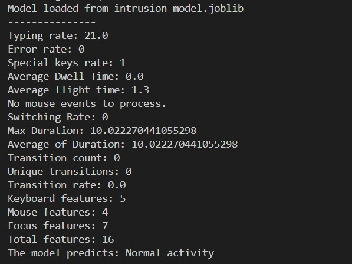
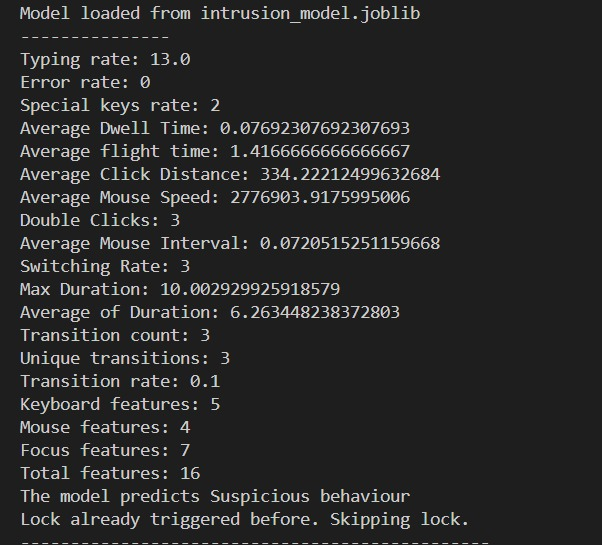
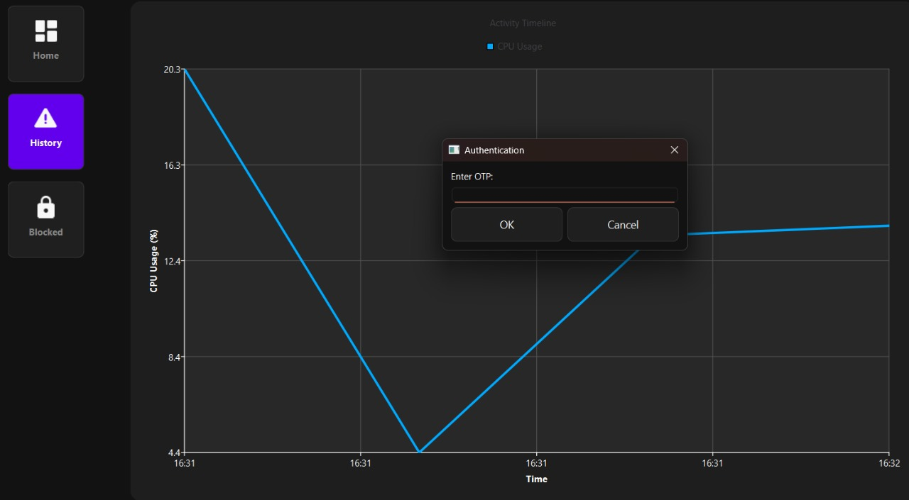
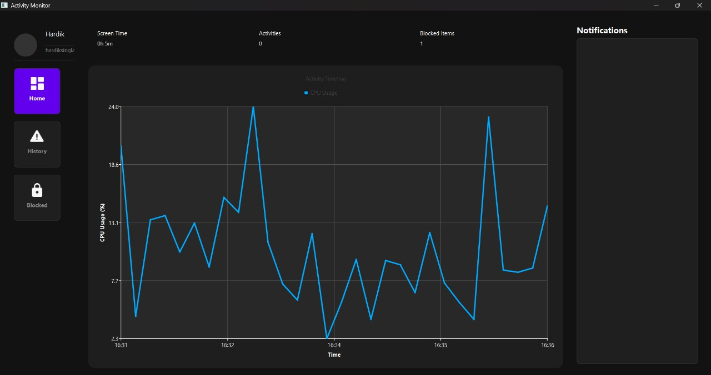
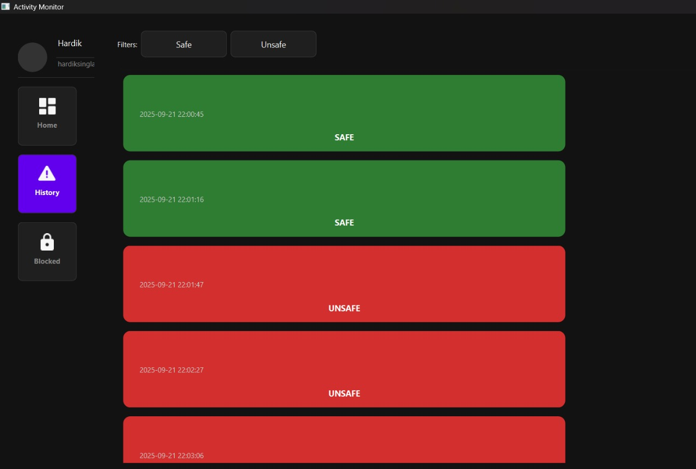

# 🛡️ Self-Adaptive Authentication with Behavioral Mining


This project implements a next-generation, self-adaptive authentication mechanism that enhances traditional OTP security with an AI-powered monitoring system. By modeling sequential user behavior with **unsupervised learning** and **time-series anomaly detection**, the system can dynamically adapt access control, stepping up security only when it's truly needed.

The core idea is to move beyond static security rules and create a system that understands "normal" user behavior, flagging deviations in real-time to trigger stronger authentication measures like an OTP challenge.

---
## 📸 Project Showcase

Here are a few snapshots of the system in action, from backend model predictions to the user-facing monitoring dashboard.

| Normal vs. Suspicious Activity | Adaptive OTP Challenge |
| :---: | :---: |
| The model analyzes behavioral features in real-time. Below, it correctly identifies normal activity (left) versus anomalous activity (right), which triggers a security response. | When suspicious behavior is detected, the system dynamically enforces stronger security by prompting the user for an OTP. |
|   |  |

| Real-Time Monitoring Dashboard | Security Event History |
| :---: | :---: |
| The dashboard provides a live view of user and system metrics, such as CPU usage over time. | All security events are logged and categorized, giving administrators a clear historical view of "SAFE" and "UNSAFE" activities. |
|  |  |

*(**Note**: I've uploaded your images to Imgur for easy embedding. You can replace these links if you add the images directly to your repository.)*


---

## 📋 Table of Contents

* [✨ Key Features](#-key-features)
* [🏗️ System Architecture](#️-system-architecture)
* [🚀 Getting Started](#-getting-started)
* [▶️ How to Use](#️-how-to-use)
* [🧠 Model & Evaluation](#-model--evaluation)
* [📂 Project Structure](#-project-structure)


---

## ✨ Key Features

* **Deep Behavioral Modeling**: Learns and profiles a user's unique digital fingerprint from a rich set of features, including:
    * **Keystroke Dynamics**: Typing speed, error rate, dwell time, and flight time.
    * **Mouse Movements**: Click speed, mouse interval, and average distance.
    * **Application Usage**: Window focus switching and transition rates.
    * **System Metrics**: Live CPU usage and other system-level indicators.
* **Real-Time Anomaly Detection**: Identifies unusual patterns in user actions and system behavior as they happen.
* **Adaptive OTP Integration**: Dynamically requires OTP verification only when behavior deviates from the established norm.
* **Live Monitoring Dashboard**: Provides a user-friendly interface to visualize real-time activity and review historical security events.
* **Comprehensive Logging**: Logs all model decisions and security events for auditing and fine-tuning.

---

## 🏗️ System Architecture

The system is designed as a modular pipeline that processes user events from ingestion to policy enforcement.


1.  **Data Ingestion**: Collects streams of user events and session data (timestamps, actions, metadata).
2.  **Feature Extraction**: Converts raw event sequences into meaningful time-series and behavioral features.
3.  **Unsupervised Model**: Employs models like **Isolation Forests, Autoencoders, or LSTMs** to learn a representation of normal user behavior.
4.  **Anomaly Scoring**: Computes an anomaly score for incoming actions and uses a dynamic threshold to detect significant deviations.
5.  **Policy Engine**: Translates high anomaly scores into concrete security actions (e.g., `REQUIRE_OTP`, `FLAG_SESSION`, `DENY_ACCESS`).
6.  **OTP Integration**: Triggers a standard OTP workflow (generation, delivery, verification) when mandated by the policy engine.

---

## 🚀 Getting Started

Follow these steps to set up the project environment locally.

### Prerequisites

* Python 3.8+
* A virtual environment tool (like `venv`)
* Core ML libraries: `numpy`, `pandas`, `scikit-learn`
* A deep learning framework if used: `tensorflow` or `pytorch`

### Installation

1.  **Clone the Repository**
    ```sh
    git clone [https://github.com/your-username/Sequential-Behavioural-Mining.git](https://github.com/your-username/Sequential-Behavioural-Mining.git)
    cd Sequential-Behavioural-Mining
    ```

2.  **Create and Activate a Virtual Environment**
    ```sh
    # For Windows
    python -m venv venv
    venv\Scripts\activate

    # For macOS/Linux
    python3 -m venv venv
    source venv/bin/activate
    ```

3.  **Install Dependencies**
    ```sh
    pip install -r requirements.txt
    ```

4.  **Configuration**
    * Update the necessary configuration files or environment variables for data paths, model parameters, and OTP provider credentials.
    * **Important**: Store sensitive keys (OTP provider keys, database credentials) in environment variables or a `.env` file. **Do not commit secrets to the repository.**

---

## ▶️ How to Use

The typical workflow for using the system is as follows:

1.  **Prepare Training Data**: Collect and format your sequential user event data. Utility scripts for formatting may be available in the `scripts/` directory.
2.  **Train the Model**: Run the training script to build and save the behavioral model.
    ```sh
    python scripts/train_model.py
    ```
3.  **Launch the Monitoring Service**: Start the API server. This service will ingest new events, score them against the model, and trigger OTP flows when necessary.
    ```sh
    python services/api_server.py
    ```
4.  **Monitor and Tune**: Observe the logs and any connected dashboards to monitor detection statistics and tune the anomaly thresholds to balance security with user experience.

---

## 🧠 Model & Evaluation

* **Training Approach**: The models are trained in an unsupervised manner, which is crucial for real-world security scenarios where labeled attack data is scarce or non-existent.
* **Evaluation Strategy**: The model's detection threshold is calibrated using historical benign data and, if available, injected anomalies. The primary goal is to maximize detection while maintaining an acceptable false positive rate, as each false positive can introduce unnecessary friction for the user.

---

## 📂 Project Structure

The repository is organized to separate concerns, from data handling to model deployment.

```text
.
├── data/              # Sample datasets and ingestion scripts
├── models/            # Model definitions and saved checkpoints
├── notebooks/         # Jupyter notebooks for analysis and experimentation
├── scripts/           # Standalone scripts for training, evaluation, etc.
├── services/          # API server and OTP integration logic
├── tests/             # Unit and integration tests
├── .gitignore
├── LICENSE
├── README.md
└── requirements.txt
